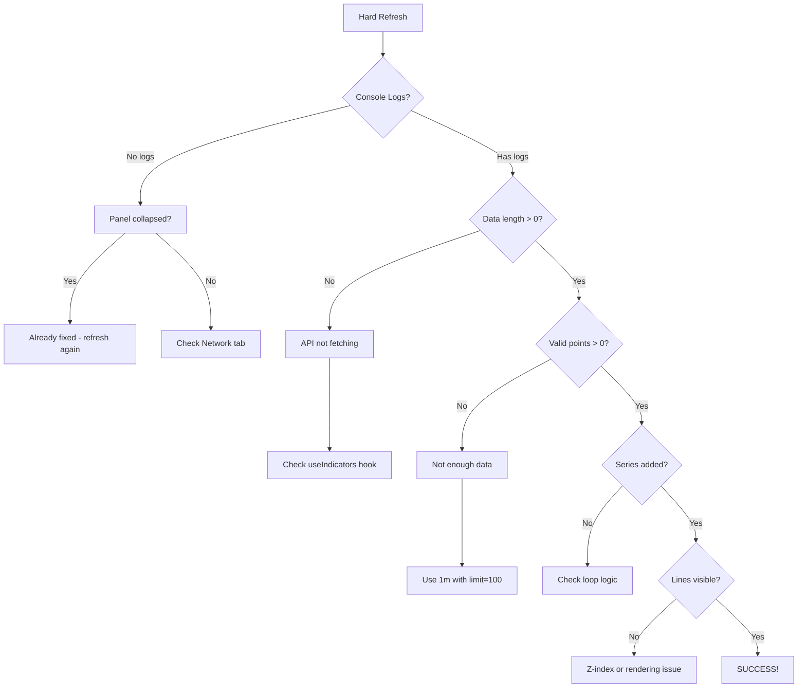

# 🔍 Indicator Debugging Instructions

**Date**: 2025-11-15 23:25 UTC+3  
**Status**: Backend working, frontend needs diagnosis

---

## ✅ Backend Verification (PASSED)

```powershell
# Tested: 1m timeframe with 100 bars
✅ API returns 100 data points
✅ 81 points have valid SMA 20 values  
✅ First 19 are null (expected - need 20 points to calculate)

Example data point:
{
  "timestamp": "2025-11-14T19:40:00",
  "symbol": "AAPL",
  "close": 182.05,
  "sma_20": 182.85  ← VALID VALUE
}
```

**Conclusion**: Backend is working perfectly ✅

---

## 🔍 Frontend Diagnosis Needed

### Step 1: Hard Refresh Browser
```
http://localhost:3000/charts
Ctrl+Shift+R (Windows) or Cmd+Shift+R (Mac)
```

### Step 2: Open Browser Console
```
Press F12
Go to "Console" tab
```

### Step 3: Enable Indicators
1. Look at right sidebar ("Technical Indicators" panel)
2. Panel should be **expanded by default**
3. Click checkbox next to **"SMA 20"** (blue dot)
4. Click checkbox next to **"SMA 50"** (orange dot)

### Step 4: Check Console Logs

**You should see these logs**:

```javascript
📊 Indicator Debug: {
  indicatorsDataLength: 100,
  enabledIndicatorIds: ["sma_20", "sma_50"],
  indicatorsDataSample: {
    timestamp: "2025-11-14T19:59:00",
    symbol: "AAPL",
    close: 182.58,
    sma_20: 182.85,  // ← Should have value
    sma_50: null     // ← May be null (need 50 points)
  },
  indicatorDataError: null,
  indicatorDataLoading: false
}

✅ Added SMA 20 indicator {
  id: "sma_20",
  dataPoints: 100,
  validPoints: 81,  // ← Should be > 0
  sampleData: [
    [1700000000000, null],
    [1700000060000, null],
    [1700000120000, 182.85]  // ← Valid point
  ]
}

📈 Total indicator series added: 2 ["SMA 20", "SMA 50"]
```

---

##  Possible Issues & Fixes

### Issue A: `indicatorsDataLength: 0`
**Cause**: API not fetching data  
**Check**:
```javascript
// In console, manually test API:
fetch('http://localhost:8000/api/v1/market-data/indicators/AAPL?timeframe=1m&limit=100&indicators=sma_20')
  .then(r => r.json())
  .then(d => console.log('API Response:', d))
```

**If 404**: Backend time range issue  
**If 200 but empty**: No data in QuestDB

### Issue B: `enabledIndicatorIds: []`
**Cause**: Checkboxes not working  
**Fix**: Already applied - panel expanded by default  
**Verify**: Panel should show checkboxes immediately

### Issue C: `validPoints: 0` (all null)
**Cause**: Not enough historical data  
**Fix**: Use 1m timeframe with limit=100 (gives 81 valid points)  
**Or**: Use higher timeframe (1h, 1d) which requires less historical data

### Issue D: Series added but lines not visible
**Cause**: Z-index or color issue  
**Fix**: Already added `z: 10` to render above candles  
**Check**: Look for thin colored lines on top of candles

### Issue E: CORS or Auth Error
**Check console for**:
```
❌ Failed to load resource: 401 (Unauthorized)
```

**Fix**: Login first at http://localhost:3000/login

---

## Expected Visual Result

After checking indicators, you should see:

```
Chart:
━━━━━━━━━━━━━━━━━━━━━━━━━
│         ┌──blue line─┐  │ ← SMA 20 (blue)
│    ┌────orange─────┐    │ ← SMA 50 (orange)
│  ▂▃▅▆█▆▅▃▂ candles     │
│                          │
└──────────────────────────┘
   Volume bars below
```

**If you don't see lines**:
- Check console logs
- Share screenshot + console output
- I'll diagnose further

---

## Test Commands

### Manual API Test
```powershell
# Test 1m with SMA 20
$r = Invoke-RestMethod "http://localhost:8000/api/v1/market-data/indicators/AAPL?timeframe=1m&limit=100&indicators=sma_20"

Write-Host "Data points: $($r.Count)"
Write-Host "Valid SMA values: $(($r | Where-Object { $_.sma_20 -ne $null }).Count)"

# Show first valid point
$first = $r | Where-Object { $_.sma_20 -ne $null } | Select-Object -First 1
$first | ConvertTo-Json
```

### Test Multiple Indicators
```powershell
$r = Invoke-RestMethod "http://localhost:8000/api/v1/market-data/indicators/AAPL?timeframe=1m&limit=100&indicators=sma_20&indicators=ema_12"

Write-Host "SMA 20 valid: $(($r | Where-Object { $_.sma_20 -ne $null }).Count)"
Write-Host "EMA 12 valid: $(($r | Where-Object { $_.ema_12 -ne $null }).Count)"
```

---

## Debug Flow



---

## Next Steps After Diagnosis

### If Indicators Work ✅
**Proceed to**: Drawing tools (Option 2)

### If Still Not Working ❌
**Share with me**:
1. Screenshot of chart
2. Console logs (all 📊 emoji messages)
3. Network tab showing indicator API call
4. I'll fix the specific issue

---

## Files Modified for Debugging

1. **CandlestickChart.tsx**
   - Added detailed console logging
   - Shows data length, valid points, sample data
   - Helps identify exact failure point

2. **IndicatorPanel.tsx**  
   - Expanded by default (line 101)
   - Users can immediately click checkboxes

3. **indicator.utils.ts**
   - Already has z-index fix (line 48)
   - Renders indicators above candles

---

**Current Time**: 23:25 UTC+3  
**Status**: Awaiting user browser test with enhanced logging  
**Next**: Based on console output, will fix specific issue
